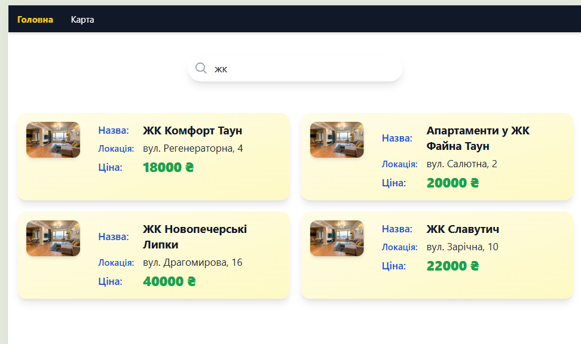
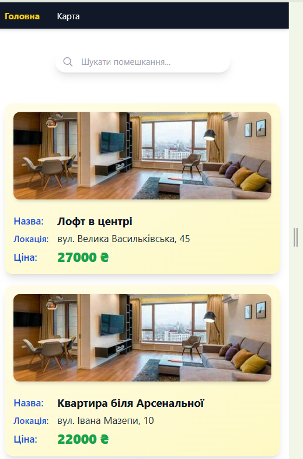
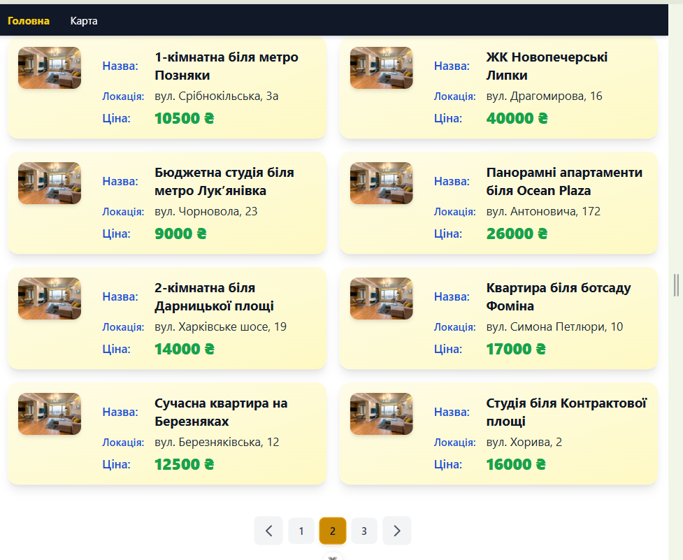
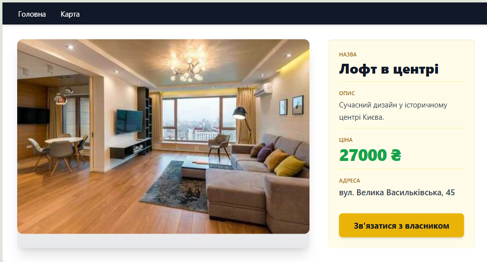
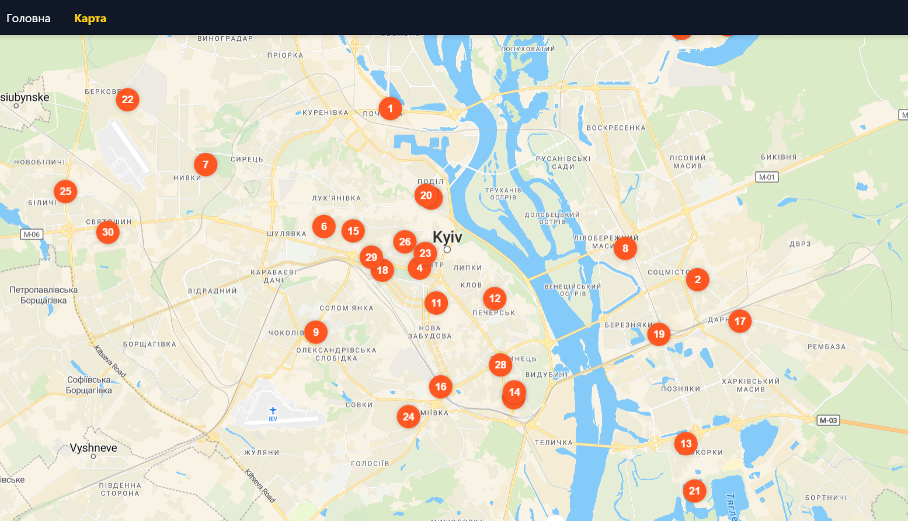

# ✅ Vue Apartment Viewer

A fully responsive Vue 3 application for browsing rental properties, viewing their details, and exploring their locations on an interactive MapLibre map. Built with a modular architecture, using Pinia for state management, and styled with TailwindCSS. Features search, pagination, and dynamic routing — all without external APIs.

## 🌐 Live Demo

- 🔗 [Live Demo](https://dvdmsk.github.io/vue-apartment/#/)
- 📎 Adaptive, animated, and fully functional test assignment deployment

## 📦 Repository

- 📁 [GitHub Repo](https://github.com/dvdmsk/vue-apartment)

## 🛠️ Technologies Used

- **Vue 3** — modern component-based framework
- **Vue Router** — navigation between views
- **Pinia** — centralized state management
- **TailwindCSS** — utility-first CSS for adaptive styling
- **MapLibre GL JS** — interactive open-source map renderer
- **TypeScript** — type safety and scalable code
- **GitHub Pages** — live deployment
- **Custom UI Components** — modular and reusable
- **CSS Transitions & Animations** — smooth interactions and hover states

## ✨ Features

- 🏠 **Home Page (`/`)** — list of rental properties with:
  - Search by name or location
  - Pagination logic
  - Property preview: name, location, price
  - Navigation via header links
- 🏢 **Property Details Page (`/property/:id`)** — full details of a property:
  - Name, description, price, and address
- 🗺️ **Map Page (`/map`)** — interactive map with:
  - Location pins for each property
  - Clickable pins navigating to the property page
- 🔎 **Search Functionality** — instant filtering of properties
- 📄 **Pagination** — view multiple pages of listings
- 📍 **Map Integration** — real GeoJSON point rendering with navigation
- ⚙️ **Pinia Store** — centralized state for all data and logic
- 🌐 **SPA Routing** — dynamic navigation using Vue Router
- 📱 **Fully Responsive** — mobile-first layout with no horizontal scroll
- 🎨 **Tailwind Styling** — clean UI with custom states and effects
- ✨ **Hover & Page Animations** — smooth transitions throughout
- 🧪 **Custom Components** — layout, card, input, pagination, modal
- 🛡️ **Search Input Validation** — fallback and UX-safe behavior

## 📸 Screenshot

  
*Home page with list, search and pagination*

  
*Home page with list, search and pagination*

  
*Home page with list, search and pagination*

  
*Property details view with full description*

  
*Interactive map with location markers*

## 🚀 Getting Started

To run the project locally:

1. **Clone the repository**

    ```bash
    git clone https://github.com/dvdmsk/vue-apartment.git
    cd vue-apartment
    ```

2. **Install dependencies**

    ```bash
    npm install
    ```

3. **Start the development server**

    ```bash
    npm run dev
    ```

4. **Build for production**

    ```bash
    npm run build
    ```

## ✅ UX & Layout Considerations

- Header with clear navigation across views
- Property cards with hover and animated transitions
- Pagination buttons with visual feedback
- Validated search input with live filtering
- Adaptive grid layout and responsive map
- Animated markers and UI transitions enhance navigation

